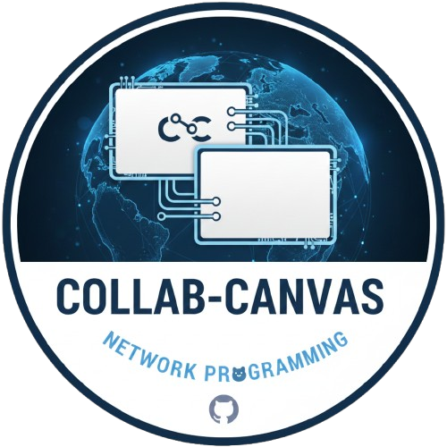

<h1 align="center">Collab Canvas</h1>

<!-- Project Logo -->

  

<h2>Description</h2>

  <strong>Collab Canvas</strong> is a real-time collaborative whiteboard application built in Python using Pygame.
  It allows multiple users to draw, update, and share visual ideas instantly across synced sessions. 
  Designed with a modular and extensible architecture, Collab Canvas emphasizes smooth synchronization, 
  a responsive interface, and clean rendering performance.

  This project was created as a group collaboration assignment and demonstrates strong software engineering
  practices including modular design, live networking, and synchronized state management.

<h2>Key Features</h2>
<ul>
  <li><strong>Real-Time Collaboration</strong> — Instantly syncs drawn points across all connected clients</li>
  <li><strong>Non-Blocking Network Handling</strong> — UI remains responsive even during message traffic</li>
  <li><strong>Intuitive Whiteboard Interface</strong> — Simple controls for drawing, clearing, and switching tools</li>
  <li><strong>Cross-Platform</strong> — Works anywhere Python & Pygame are supported</li>
  <li><strong>Modular Architecture</strong> — Easy to extend with new tools, brushes, shapes, or networking features</li>
  <li><strong>Lightweight & Fast</strong> — Minimal dependencies with optimized event handling</li>
</ul>

<h2>Built With</h2>
<ul>
  <li>Python 3.x</li>
  <li>Pygame</li>
  <li>Sockets / Custom Networking Logic</li>
</ul>

<h2>How to Use</h2>

<em>(Instructions will be added later.)</em>

<h2>Project Leads</h2>
<ul>
  <li><strong>Kaden Landry</strong> (GitHub: https://github.com/LandryTech)</li>
  <li><strong>Kevin Eloi</strong> (GitHub: https://github.com/eloikwitedu)</li>
</ul>

<h2>Contact</h2>
<ul>
  <li><strong>LinkedIn:</strong> <a href="linkedin.com/in/kadenlandry">Kaden Landry</a></li>
  <li><strong>LinkedIn:</strong> <a href="https://www.linkedin.com/in/kevin-eloi">Kevin Eloi</a></li>
</ul>
